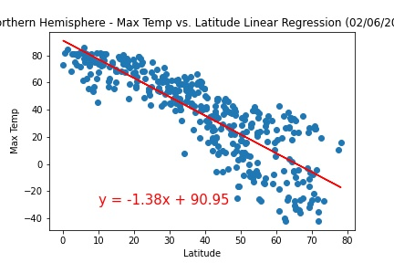

# Equator Equation - What's the Weather Like?

## Background

The purpose of the Equator Equation project is to prove through data analysis that it really does get hotter as you move closer to the equator.  

The project will also look at other weather features like cloudiness, wind speed and humidity to understand how they are impacted by equator proximaty. 

## Part I - WeatherPy

For part one of this project, I created a Python script to visualize the weather of 500+ cities across the world of varying distance from the equator using Jupyter Notebook. 

To accomplish this, I leveraged the Python library pypi and citipy as well as the [OpenWeatherMap API](https://openweathermap.org/api).

The first requirement was to create a series of scatter plots leveraging Matplotlib to showcase the following relationships:

* Temperature (F) vs. Latitude
* Humidity (%) vs. Latitude
* Cloudiness (%) vs. Latitude
* Wind Speed (mph) vs. Latitude

The second requirement was to run linear regression on each relationship using Pandas. The plots had to be seperated by Northern Hemisphere (greater than or equal to 0 degrees latitude) and Southern Hemisphere (less than 0 degrees latitude):

* Northern Hemisphere - Temperature (F) vs. Latitude
* Southern Hemisphere - Temperature (F) vs. Latitude
* Northern Hemisphere - Humidity (%) vs. Latitude
* Southern Hemisphere - Humidity (%) vs. Latitude
* Northern Hemisphere - Cloudiness (%) vs. Latitude
* Southern Hemisphere - Cloudiness (%) vs. Latitude
* Northern Hemisphere - Wind Speed (mph) vs. Latitude
* Southern Hemisphere - Wind Speed (mph) vs. Latitude

The final requirement of this part of the project was to randomly select at least 500 unique (non-repeat) cities based on latitude and longitude.  

I then performed a weather check on each city using a series of successive API Calls and saved the results to a CSV file.

I completed this assessment by noting observable trends in the weather data.

### Part II - VacationPy

The next part of this project was to identify ideal vacation locations using jupyter-gmaps and the Google Places API.

I created a heatmap which displayed the humidity for the cities identified in Part I of this project.  

I then narrowed down my data frame to ideal weather conditions:

  * A max temperature lower than 80 degrees but higher than 70.

  * Wind speed less than 10 mph.

  * Zero cloudiness.

* Using the Google Places API I found the first hotel for each city located within 5000 meters of the coordinates. The hotels were then overlayed on the humidity heatmap.  

### Contact
Lauren Parrish 
ljeanparrish@gmail.com
